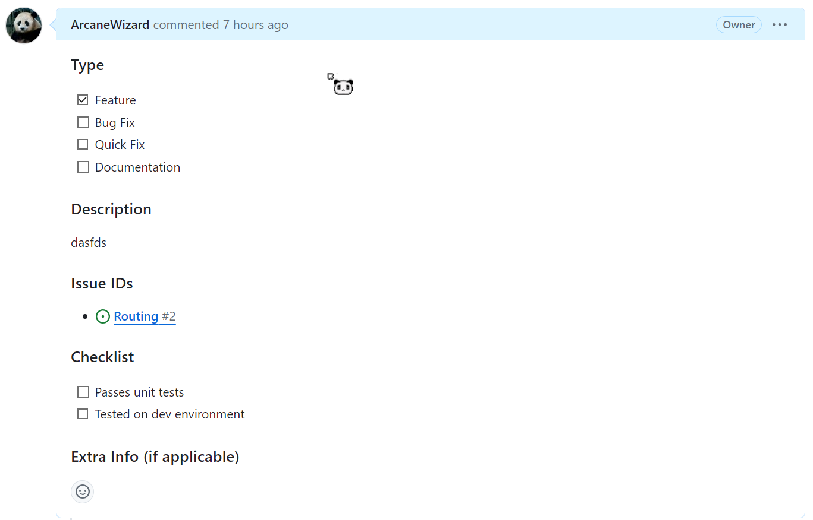

# Contributing guidelines
See [Setup.md](./docs/Setup.md) first to setup the project on your local environment.

## Contributing
  Pick an issue in the repository with a ```Ready``` tag, and assign it to yourself.
  Aim to meet the acceptance criteria when completing the issue's tasks. When done, create a pull request (PR)
  to merge your branch with the master branch. Below is the default PR template you must fill out when u create a PR.
  
  )  

## Creating an issue
  If you are creating an issue, a default template will pop up. You should describe what feature/problem
  the issue is about, some acceptance criteria (goals), and a concrete set of tasks to complete (ex. writing 
  unit tests). 
  
  Each issue should have at least two labels:

  1. A type label like ```feature```, ```enhancement``` or ```bug```.
  2. A priority label like ```Ready```(the issue is ready to be picked up), ```BackBurner``` (the issue shouldn't be priotized yet), or ```RoughDraft``` (the issue isn't complete)

  *Note: Adding UI doesn't require unit tests, but at the bare minimum, the task list should include testing the implementation on your local dev environment.